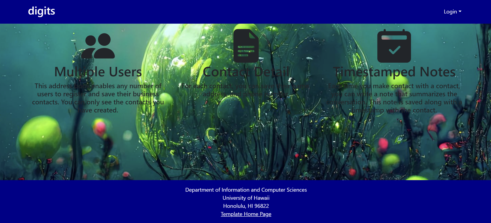
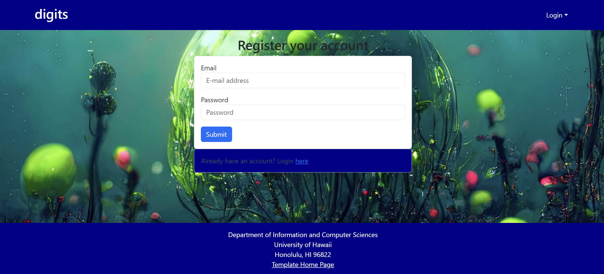
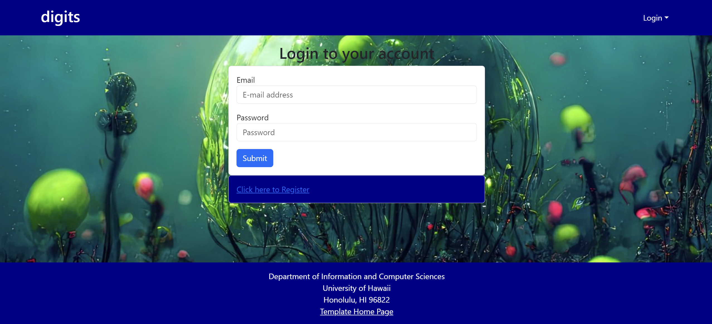
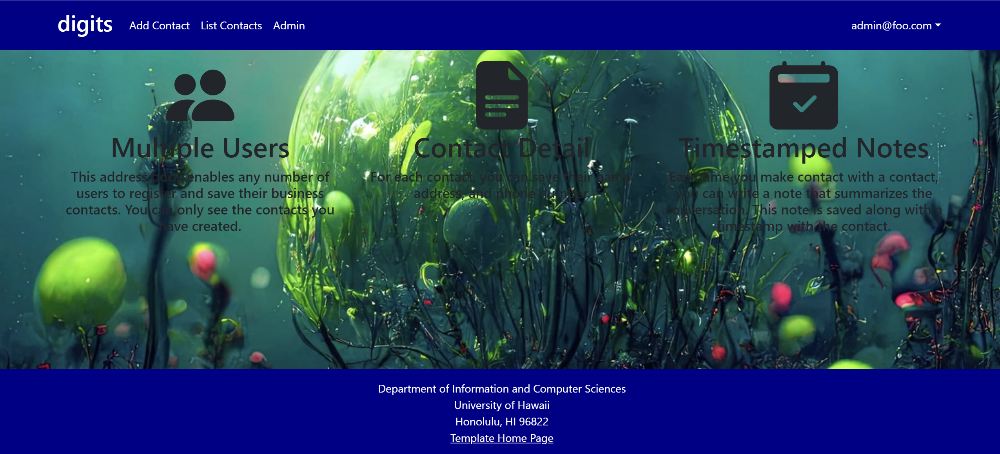

## digits

### Installation
first, install Meteor

second, download the copy of the application

third, to run the application, type the following command in the terminal
```bash
$ meteor npm install
```
to install all the dependencies

then, type the following command to run the application
```bash
$ meteor npm run start
```

### Home Page

here is the home page of the application, which you can sign up or login to the application.

### Sign Up

here is the sign up page of the application, which you can sign up to the application.

### Login

here is the login page of the application, which you can login to the application.

### User Landing Page

here is the user landing page of the application, which you can see the list of the digits you have created.

### List Contacts

here is the list contacts page of the application, which you can see the list of the contacts you have created.
you also can add note to the contact, edit the contact, or delete the contact.

### Admin Landing Page

here is the admin landing page of the application, which is different from the user landing page, you can see the list of the digits you have created, and you can also see the list of the users.


